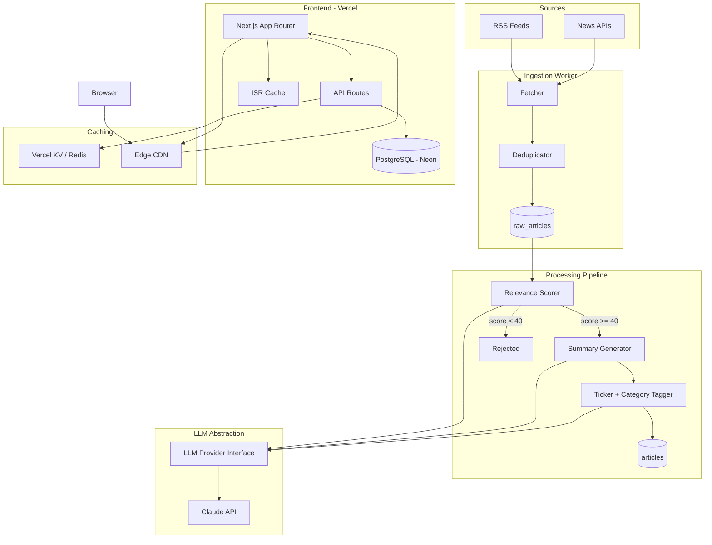

# Architecture Overview

## System Diagram

## Key Components

### News Ingestion Service
- **Purpose:** Fetches articles from configured sources on a 5-minute cycle
- **Location:** `src/services/ingestion/`
- **Dependencies:** RSS parser, news API clients, Postgres

### Relevance Scoring Pipeline
- **Purpose:** Scores articles 0–100 on AI market relevance using LLM
- **Location:** `src/services/scoring/`
- **Dependencies:** LLM abstraction layer, Postgres

### Summary Generator
- **Purpose:** Produces concise factual summaries with "Why It Matters" section
- **Location:** `src/services/summary/`
- **Dependencies:** LLM abstraction layer, Postgres

### Ticker & Category Tagger
- **Purpose:** Identifies impacted public companies and AI categories
- **Location:** `src/services/tagging/`
- **Dependencies:** LLM abstraction layer, ticker reference data, Postgres

### LLM Abstraction Layer
- **Purpose:** Provider-agnostic interface for all LLM calls, enabling model switching without refactor
- **Location:** `src/lib/llm/`
- **Dependencies:** Claude API (default provider)

### API Routes
- **Purpose:** RESTful endpoints for article feed, detail, ticker/category filtering
- **Location:** `src/app/api/`
- **Dependencies:** Drizzle ORM, Postgres, Vercel KV cache

### Frontend Pages
- **Purpose:** SSR/ISR pages for homepage feed, article detail, category views
- **Location:** `src/app/(pages)/`
- **Dependencies:** API routes, Next.js ISR

## External Dependencies

| Service | Purpose | Docs |
|---------|---------|------|
| Neon | Serverless PostgreSQL | neon.tech/docs |
| Vercel | Frontend hosting, SSR, ISR, edge caching | vercel.com/docs |
| Vercel KV | Redis-compatible key-value cache | vercel.com/docs/storage/vercel-kv |
| Claude API | LLM for scoring, summaries, tagging | docs.anthropic.com |
| Inngest / BullMQ | Background job scheduling | inngest.com/docs |
| Sentry | Error tracking and monitoring | docs.sentry.io |

## Environment Variables

| Variable | Purpose | Required |
|----------|---------|----------|
| `DATABASE_URL` | Neon Postgres connection string | Yes |
| `ANTHROPIC_API_KEY` | Claude API authentication | Yes |
| `KV_REST_API_URL` | Vercel KV endpoint | Yes |
| `KV_REST_API_TOKEN` | Vercel KV authentication | Yes |
| `NEWS_API_KEY` | News API authentication (if using paid API) | Optional |
| `SENTRY_DSN` | Sentry error tracking | Optional |
| `NEXT_PUBLIC_SITE_URL` | Public site URL for SEO/OG tags | Yes |
